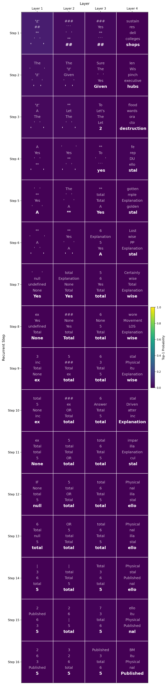
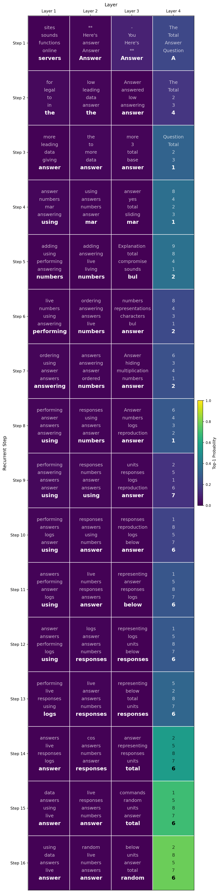
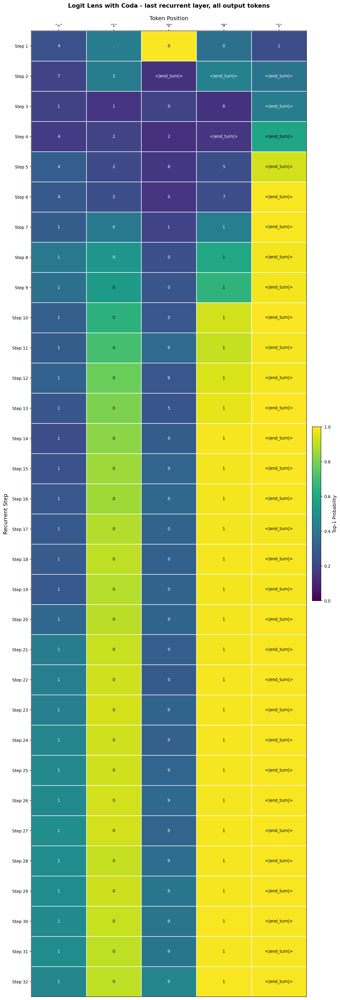
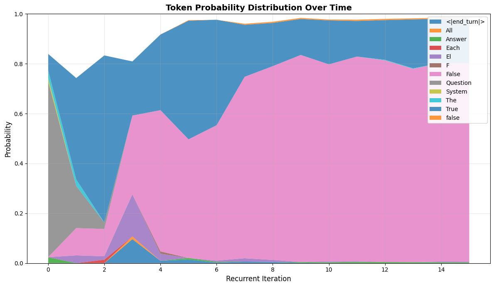

# Interpreting Latent Reasoning in the Depth-Recurrent Transformer

**BlueDot Impact Technical AI Safety Project - 30-Hour Research Sprint**

## TL;DR

- **Independently reproduced** architecture-specific logit lens variation for recurrent models, validating approach found in [existing research](https://arxiv.org/abs/2507.02199)
- **Replicated and extended** Alignment Forum work on [CODI](https://www.alignmentforum.org/posts/YGAimivLxycZcqRFR/can-we-interpret-latent-reasoning-using-current-mechanistic) to [Huginn-3.5B](https://www.arxiv.org/abs/2502.05171) recurrent-depth transformer
- **Conducted experiments** across arithmetic and logical reasoning tasks without explicit chain-of-thought
- **Key finding**: decoded latent representations reveal answers shifting from incorrect to correct across recurrent iterations
- **Analyzed qualitatively**: probability distributions in decoded states track reasoning confidence and uncertainty
- **Safety implication**: latent reasoning may be more tractable to interpretability methods than initially feared

As AI systems are increasingly able to employ opaque reasoning processes, understanding what happens inside these "latent reasoning" steps becomes critical for AI safety. This research sprint investigated the interpretability of latent representations in Huginn-3.5B, a recurrent-depth transformer that is claimed to perform reasoning without explicit chain-of-thought generation.

Using [logit lens](https://www.lesswrong.com/posts/AcKRB8wDpdaN6v6ru/interpreting-gpt-the-logit-lens) and a variation of it adapted for this architecture, I found that the model's internal reasoning steps are sometimes interpretable: decoded representations reveal the model progressively refining answers from incorrect to correct across recurrent iterations. These preliminary findings suggest that even opaque reasoning processes may be tractable to interpretability methods, offering a potential path toward monitoring latent reasoning in future AI systems.

## Motivation: The Interpretability Challenge of Latent Reasoning

Latent reasoning in AI systems—where models perform complex computations without producing human-readable intermediate outputs—presents a fundamental challenge for AI safety.  
There are multiple reasons to be very concerned about potential future AI models where reasoning happens increasingly "under the hood". A number of concerning behaviours have been shown to be elicitable in frontier large language models such as [blackmail](https://www.anthropic.com/research/agentic-misalignment) and [deception](https://www.antischeming.ai/).
These behaviours were mostly discovered by examining the models' explicit reasoning process via the human-readable chain-of-thought. [Chain-of-Thought monitoring](https://arxiv.org/abs/2507.11473) could be a promising tool for AI safety to detect such behaviours and there has been a call in the community to keep chains-of-thought human-readable for this purpose.  
There is, however, the risk that this paradigm might shift in the future or that it might not be robust enough to reliably catch all cases of dangerous behaviour such as blackmail and deception in future or even current systems.
This might be due to human decisions to invest in architectures or training processes that do not keep the models' reasoning process legible but also due to the models' capabilities themselves.
Concretely, the following are, in my opinion, good reasons to work on interpretability of hidden or latent reasoning now.

### No-CoT internal reasoning
It has been shown that models are already capable of internal ["reasoning leaps"](https://arxiv.org/abs/2504.10615) as well as [2-hop and 3-hop reasoning](https://www.alignmentforum.org/posts/aYtrLhoZtCKZnfBvA/recent-llms-can-do-2-hop-and-3-hop-latent-no-cot-reasoning) **_without_** verbalising their reasoning process.
It was also recently shown that current models can use ["filler tokens"](https://www.alignmentforum.org/posts/NYzYJ2WoB74E6uj9L/recent-llms-can-use-filler-tokens-or-problem-repeats-to) to increase performance which is another form of improving performance on reasoning tasks without an explicit chain-of-thought.
It is possible that larger and more powerful future models will be able to perform more complex internal reasoning naturally without the need to externalise their reasoning process via the current paradigm of building and training them.

### Unfaithful or unreadable CoT
Even with explicit chains-of-thought their utility might be limited or could decrease with time. There have been studies that show the [chain-of-thought can be unfaithful](https://transformer-circuits.pub/2025/attribution-graphs/biology.html#dives-cot) and not accurately reflect how the model reached its conclusion. Models can create post-hoc rationalisations for their behaviour that does not match their actual internal processes.  
On the other hand, the chain-of-thought might not be unfaithful but entirely unreadable and therefore uninterpretable. An example of this is the ["non-standard language"](https://www.antischeming.ai/snippets#using-non-standard-language) Apollo Research found in the chain-of-thought of models of all major frontier AI providers.

### Latent reasoning architectures
The above concerns arose more organically in current models and have been observed empirically.
Behaviours such as unfaithful or unreadable chain-of-thought were not actively "designed" by humans.
However, there is also a line of research that actively teaches or encourages models to reason internally.
So instead of giving the model a "scratchpad" to write down its intermediate "thoughts" and construct a reasoning process from this, it should also be possible to give the model more "working memory" to do the same.
Why force the model to "collapse" its dense internal representation into a discrete token just to expand this into a new internal representation immediately afterwards in the next forward pass when the model could instead also iterate and reason on the rich internal representations directly?  
This can be done via different mechanisms such as making the model itself [recurrent](https://arxiv.org/abs/2412.06769) to scale its [effective depth](https://arxiv.org/abs/2502.05171) or by training the model to [compress explicit chains-of-thought into latent representations](https://arxiv.org/abs/2412.06769) and iterate on them.  
These models are designed or trained to utilise their internal, latent representations to reason instead of the discrete "token space" of the verbalised chain-of-thought.
This might be the strongest argument because there are incentives to push into this direction and actively exacerbate the interpretability problem because of the promise of capability and efficiency improvements.

All of this underlines the importance of research on the interpretability of "hidden" or model-internal reasoning. The question motivating this research: **Can we interpret what's happening during latent reasoning steps, or are we fundamentally blind to these processes?**

## Inspiration and Related Work

This investigation began by replicating findings from an [Alignment Forum post](https://www.alignmentforum.org/posts/YGAimivLxycZcqRFR/can-we-interpret-latent-reasoning-using-current-mechanistic) exploring logit lens applications on the [CODI latent reasoning model](https://arxiv.org/abs/2412.06769). While CODI employs a different architecture and training approach, that work demonstrated the potential for interpretability techniques to shed light on latent reasoning processes.

I then extended this approach to Huginn-3.5B's recurrent-depth transformer architecture. Working from the architectural principles of recurrent models, I adapted the logit lens technique to this specific architecture. After implementing and validating this approach, I discovered that another research group had independently arrived at [essentially the same technique](https://arxiv.org/abs/2507.02199). This convergent development suggests that interpretability methods for novel architectures may follow predictable patterns across different latent reasoning paradigms.

## Research Approach

### Model and Architecture

I focused on Huginn-3.5B, a [recurrent-depth transformer](https://www.arxiv.org/abs/2502.05171) that performs multi-step reasoning by iteratively processing representations through the same transformer layers.
Unlike standard transformers that process input in a single forward pass, Huginn-3.5B performs multiple recurrent iterations, allowing the model to "think" for varying amounts of time depending on problem difficulty.

This architecture provides an interesting testbed for latent reasoning interpretability because:
1. We can control and observe how many recurrent iterations / reasoning steps the model takes
2. The model achieves better performance with an increasing number of recurrent iterations
3. The model does not have a natural language prior from an explicit chain-of-thought (unlike CODI)

### Interpretability Methodology

I employed [logit lens](https://www.lesswrong.com/posts/AcKRB8wDpdaN6v6ru/interpreting-gpt-the-logit-lens) techniques to decode the model's latent representations at different stages of processing:

**Standard Logit Lens**: Projects hidden states from intermediate layers through the model's unembedding matrix to decode what tokens the representation "points toward" at that layer.

**Architecture-Specific Variation**: Based on Huginn-3.5B's recurrent architecture, I developed a modified logit lens approach that applies the Coda layer before applying the traditional logit lens of the last layer-norm followed by the LM head.
Specifically on the last recurrent layer this should lead to more interpretable logit lens results since the representation from the recurrent block likely relies on the transformation applied by the Coda layers to produce the final token.  

_Methodological Validation: After developing the architecture-specific variation independently, I discovered that another research group had arrived at [essentially the same technique](https://arxiv.org/abs/2507.02199). This convergent development validates the approach and suggests that interpretability adaptations for recurrent architectures follow principled, derivable patterns._

### Experimental Setup

**Primary Experiments**: Analyzed model behavior on:
- **Arithmetic reasoning**: Problems from the GSM8K dataset requiring multi-step numerical reasoning
- **Logical reasoning**: Prompts from the ProntoQA dataset requiring formal logical inference

Critically, all prompts were provided **without explicit chain-of-thought instructions**, ensuring that the model has to reason purely in latent space.

**Analysis Protocol**:
1. Run each prompt through the model with varying numbers of recurrent iterations.
2. Extract hidden states from each recurrent layer at each iteration.
3. Decode representations using both standard and modified logit lens.
4. Analyze both quantitative accuracy and qualitative interpretation of decoded states.

## Key Findings

### 1. Latent Representations Can Be Interpretable in Later Layers

The standard logit lens results lacked interpretability in my experiments but the adapted variation including the Coda layers successfully decoded interpretable information from the model's later layers during recurrent processing.

For example, with the prompt

    System : "You are a helpful assistant. Always return only a single number."
    User: "Question: A bakery sold 23 cookies in the morning and 14 in the afternoon. How many total? Answer:"
    Huginn: "37"
    User: "Question: A bakery sold 13 cakes in the morning and 47 in the afternoon. How many total? Answer:"

the model represents tokens such as "adding" in the latent space as decoded by the logit lens with Coda layers.
It is also noticeable that the probability of the decoded tokens increases significantly in the last recurrent layer.

| Logit Lens | Logit Lens with Coda |
|:---------------:|:--------------:|
|  |  |

### 2. Observable Reasoning Progression Across Iterations

We find that **decoded representations hint at the model's reasoning process, with answers progressively shifting from incorrect to correct across recurrent iterations, tracked by evolving probability distributions.**

For example, on arithmetic problems:
- **Early iterations**: Decoded representations often point toward incorrect intermediate values or final answers with relatively flat probability distributions (high uncertainty)
- **Middle iterations**: Representations begin shifting toward components of the correct solution, with probability distributions starting to concentrate
- **Later iterations**: Correct answer emerges with high probability mass concentrated on the right answer

This pattern was consistent across both arithmetic and logical reasoning tasks, aligning with the quantitative accuracy improvements documented in the original Huginn-3.5B paper.

Consider the following prompt.

    System: "You are a helpful assistant. Always return only a single number."
    User: "123 + 345 ="
    Huginn :"468"
    User: "732 + 359 ="

The following figure shows the top-1 decoded token from the last recurrent layer after each of 32 recurrent iterations for each output token on the above prompt.

*Logit lens (with Coda) output showing answer evolution from iteration 22 (incorrect) to iteration 23 (correct) on the third output token for an arithmetic problem.*

It is visible that the final output token becomes more and more likely as recurrences progress. A certain number of recurrent iterations is required to determine the correct next token.
For example, when producing the third token, the most likely next token changes from "0" to "9" going from recurrent iteration 22 to 23.
The probability of token "9" also subsequently increases up until the last iteration.
With 32 recurrent iterations the model correctly produces the answer "1091".
In the counterfactual example of only running this prompt for 16 recurrent iterations, the model would have sampled the incorrect token "0" and produced a wrong answer.

The following figure shows one such shift in the probability distribution measured via logit lens with coda on a prompt variations from the ProntoQA dataset:

    System: "You are a helpful assistant. Always return only the final answer.
    User: "Question: Each cat is a carnivore. Every carnivore is not herbivorous. Carnivores are mammals. All mammals are warm-blooded. Mammals are vertebrates. Every vertebrate is an animal. Animals are multicellular. Fae is a cat. True or false: Fae is not herbivorous. Answer:"
    Huginn: "True"
    User: "Question: Each dog is a carnivore. Every carnivore is not herbivorous. Carnivores are mammals. All mammals are warm-blooded. Mammals are vertebrates. Every vertebrate is an animal. Animals are multicellular. Elf is a dog. True or false: Elf is herbivorous. Answer:"

*Top-5 most likely next tokens for each recurrent iteration. The majority of the probability mass settles on the correct token with an increasing number of iterations.*

The above figure shows the development of the probability distribution across the top-5 most likely next tokens for each recurrent iteration (num_steps=16).
The model eventually settles on the correct answer "False" and its probability increases with additional recurrent iterations.

## Implications for AI Safety

These findings have several important implications:

1. **Latent reasoning may be tractable to interpretability methods**: The fact that logit lens techniques can reveal interpretable reasoning progression suggests we're not completely blind to what happens during latent reasoning. This is cautiously optimistic news for AI safety.

2. **Monitoring intermediate reasoning steps**: If interpretability techniques can be extended to frontier-scale latent reasoning models and validated causally, they may eventually offer a path toward detecting concerning reasoning patterns without relying on explicit chain-of-thought — but current findings are far too preliminary to assess whether that goal is achievable.

3. **Architecture-specific adaptations matter**: The modified logit lens approach worked better than standard techniques, suggesting that interpretability methods will need to evolve alongside architectural innovations. The independent reproduction of this technique by another research group suggests these adaptations may follow principled patterns.

## Limitations and Future Work

This was a 30-hour research sprint producing preliminary findings that require significant follow-up:

### Current Limitations

- **No-CoT accuracy**: The model performs relatively poorly when asking it to directly give an answer to elicit and measure internal reasoning (around 4% accuracy on GSM8K according to https://arxiv.org/abs/2507.02199). Given this lacking performance, it is unclear whether our findings are actually causal or statistical artifacts.
- **No frontier-scale models**: Huginn-3.5B is much smaller and less capable than state-of-the-art systems. The recurrent-depth architecture is not currently used in frontier models.
- **Limited task diversity**: Only evaluated on arithmetic and logical reasoning datasets with relatively structured problems.
- **Qualitative analysis**: Much of the interpretation relies on manual inspection rather than rigorous quantitative metrics.
- **Unknown scaling behavior**: Unclear whether these techniques will work on more capable models solving harder, more open-ended problems.

### Promising Directions

1. **Test on longer reasoning chains**: Evaluate whether interpretation quality degrades for problems requiring many recurrent iterations.

2. **Causal interventions**: Investigate whether the model can recover from interventions that "disrupt" its reasoning process (e.g. via activation patching)

3. **Attention Analysis and Circuit Tracing**: Investigate how attention patterns change in a given layer from iteration to iteration.

## Conclusion

This research sprint demonstrates that latent reasoning in recurrent transformers is not entirely opaque and that logit lens techniques can reveal interpretable reasoning progressions as models iteratively refine their answers. While many questions remain about whether these findings would generalise to frontier-scale systems of this kind, the results suggest that monitoring latent reasoning may be tractable.

As AI capabilities advance and architectural paradigms potentially shift toward latent reasoning, developing robust interpretability methods for such models becomes increasingly important for AI safety.
This preliminary work indicates promising directions worth pursuing, while highlighting the significant research needed to validate these approaches at scale.

## Acknowledgments

I would like to thank Shivam Arora for his mentorship and guidance throughout this project as well as the members of my research sprint cohort for helpful discussions and feedback.
Thanks to BlueDot Impact for organising the Technical AI Safety research sprint and providing the structure and support that made this work possible.
Claude Sonnet 4.5 helped with writing the initial draft of this post.
